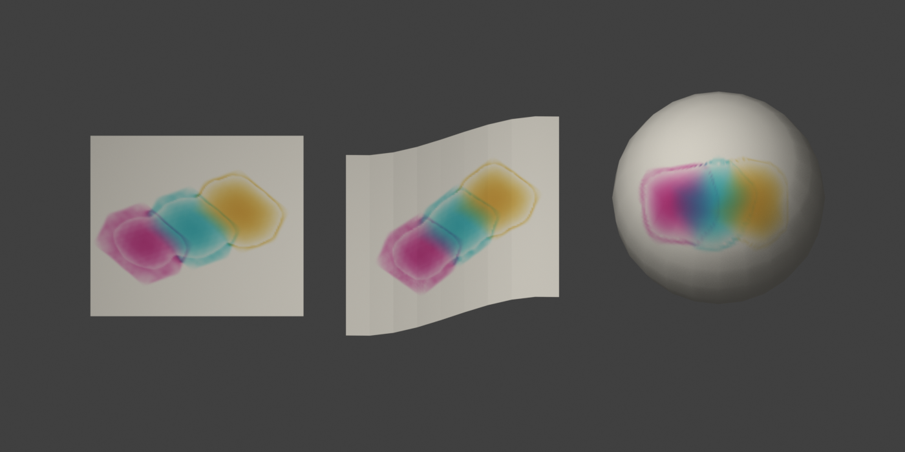

# Blender Watercolor

Paint water and pigment directly onto a mesh while it spreads, absorbs and dries.

Blender Watercolor is an experimental, local Blender extension for porous-surface painting. It includes native painting controls, a conservative surface simulation and translucent pigment optics. No accounts, external services or downloads are needed while painting.



## Installation

Requires Blender 5.2 LTS. Download the [release ZIP](https://github.com/mgwilt/blender-watercolor/releases/latest), open **Edit → Preferences → Get Extensions**, use the menu's **Install from Disk**, select the ZIP and enable Blender Watercolor.

Open the 3D Viewport sidebar (`N`) and choose **Watercolor**. The commands are also available through `F3` search.

## Paint your first wash

1. Select a static mesh in Object Mode. A subdivided plane or gently curved sheet is a good starting point.
2. Choose a target cell count and texture size, then click **Prepare Surface**. The tool preserves the original mesh and creates a private canvas/material on a triangulated copy with the same shape.
3. Choose a paper preset and pigment, adjust brush radius and water/pigment load, then click **Start Live Painting**.
4. Drag with the left mouse button. Water and pigment continue moving while you paint. Middle-mouse navigation remains available.
5. Use `1` for Pigment, `2` for Water and `3` for Lift. Press `Space` to pause/resume drying and `Ctrl Z` to undo a watercolor stroke. `Esc` finishes painting.
6. **Bake Layer** commits the current optical appearance as a dry underpainting. Add another wash for translucent glazing. **Reset** starts over; **Restore Original** restores the original mesh/materials.
7. Save the `.blend` to retain the simulation, stroke history and packed texture. Reopen it with the extension enabled, then start painting to continue. Export the paint texture as PNG when needed.

Water is simulated on connected surface cells, independently of the display UV atlas. It crosses UV seams and stays on the connected mesh; it does not jump to a nearby disconnected sheet. Gravity influences runs along the surface.

## Current limits

- Experimental graphics model, not measured pigment chemistry or a full fluid solver.
- Static manifold meshes, including open sheets. Apply modifiers/shape keys on a copy first. Geometry or transform changes require preparing again.
- Uniformly refined surface cells; tiny triangles can force slower timesteps. The cell target is approximate.
- The brush uses graph-geodesic distances, so coarse surfaces can show directional bias.
- Pigment concentration is interpolated from surface cells. Detail is limited by simulation resolution, not just texture size.
- Drying advances in model time. Under load the simulation slows rather than taking unstable steps.
- Three synthetic pigment presets. Mixing is subtractive optical composition; coefficients are not measured spectra.
- Stroke undo restores the complete simulation state before that stroke, including subsequent drying. The latest twelve undo states are retained.
- No animated deformation, detached droplets or flow between separate objects.
- EEVEE supports live material preview; baked materials also render in Cycles. See [validation](docs/validation.md) for tested platforms and measurements.

## Development

The reusable numerical core imports NumPy only. Blender supplies NumPy for the extension; an external Python installation can use `uv sync`.

```sh
uv run python -m unittest discover -s tests -v
uv run python scripts/benchmark.py
uv run python scripts/build_extension.py
blender --background --factory-startup --python-exit-code 1 --python scripts/verify_blender.py
blender --background --factory-startup --python-exit-code 1 --python scripts/verify_blender.py -- --reopen
```

Build outputs and test scenes are generated under `build/` and `dist/`. The extension and numerical package share one source tree. See [the numerical model](docs/model.md), [sources](docs/sources.md) and [contributing](CONTRIBUTING.md).

Code is licensed under GPL-3.0-or-later. Original procedural demonstration assets are CC0.
